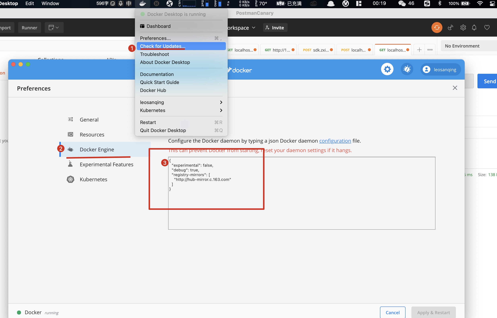
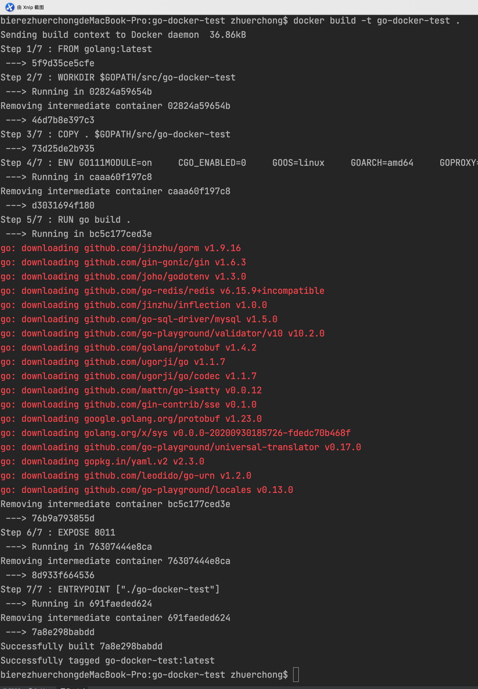
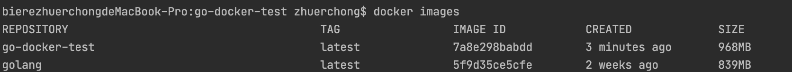
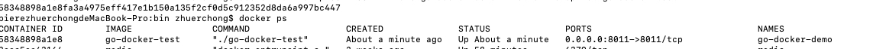
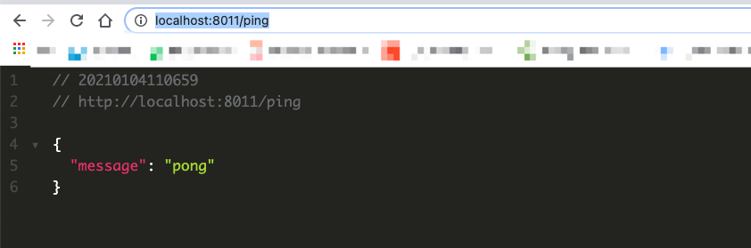
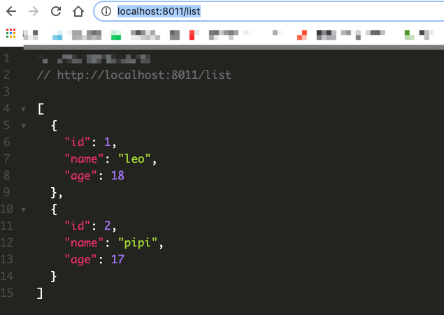
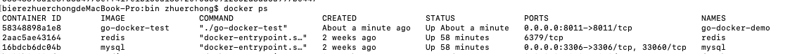
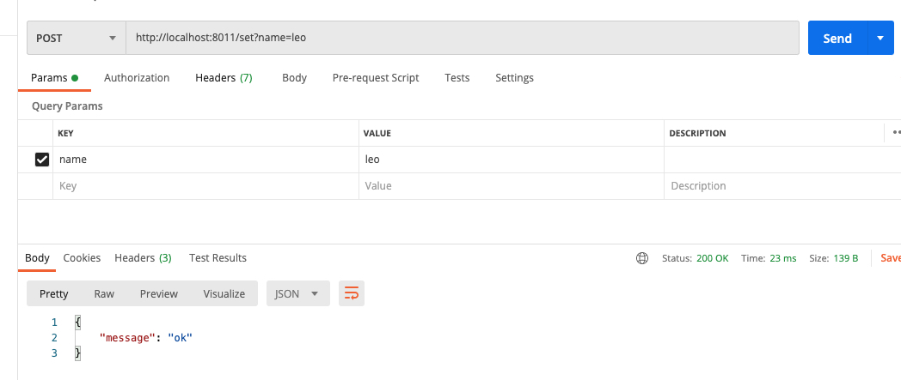

# 前言

Docker 容器化技术现在非常火，这边也与时俱进一下，使用 Docker 部署项目，并用Docker 管理其他第三方组件

先使用一个 demo 项目对整体

[Demo 地址](https://github.com/leosanqing/go-docker-test)

# Docker 下载与安装

1. [Docker下载与安装](https://www.runoob.com/docker/macos-docker-install.html)

2. 使用镜像加速。安装完后我们使用docker命令`docker pull mysql:latest`拉取一个 Mysql 镜像时会发现非常的慢，这个时候我们就要使用国内镜像进行加速了。使用过 Maven 的应该都知道，两者类似。(这边主要是 Mac的教程，其他系统的可自行搜索，步骤都一样)

   

   贴上下面这个国内镜像

   ```json
   {
     "experimental": false,
     "debug": true,
     "registry-mirrors": [
       "http://hub-mirror.c.163.com"
     ]
   }
   ```

   

3. 再次尝试拉取应该会非常快。然后运行这个镜像 `docker run -itd --name mysql-test -p 3306:3306 -e MYSQL_ROOT_PASSWORD=123456 mysql`。这个命令的意思是 `docker(docker命令通用前缀) run(运行一个容器) -itd(后台运行) --name mysql-test(名字为mysql-test) -p 3306:3306(容器端口映射到宿主机) -e MYSQL_ROOT_PASSWORD=123456(root用户密码) mysql(刚刚拉下来的镜像名)`

   > 用镜像 mysql 后台启动一个 mysql-test 端口为3306并且映射到宿主机也是3306，root 账户密码 为 123456 的容器。 如果启动不起来，注意看自己的mysql 是否在运行， 3306端口是否被占用

4. 使用 mysql 命令或者 类似 Navicat 的数据库管理工具连接看看


# 简单部署Go Demo

使用最简单的 Gin框架，部署到 docker 容器中，我们访问 `localhost:8011/ping`，看是否能返回 pong


```go
package main

import (
	"github.com/joho/godotenv"
	"go-docker-test/cache"
	"go-docker-test/model"
	"go-docker-test/server"
)

func main() {
	r := server.NewRouter()
	r.Run(":8011")
}

```

```go
package server

import (
   "github.com/gin-gonic/gin"
   "go-docker-test/cache"
   "go-docker-test/model"
)

func NewRouter() *gin.Engine {
   r := gin.Default()

   // 路由
   v1 := r.Group("")
   {
      v1.GET("ping", func(context *gin.Context) {
         context.JSON(200, gin.H{
            "message": "pong",
         })
      })
   }
   return r
}

```


# Dokcer 命令

## Dockerfile

```dockerfile
FROM golang:latest

WORKDIR $GOPATH/src/go-docker-test
COPY . $GOPATH/src/go-docker-test

# 为我们的镜像设置必要的环境变量
ENV GO111MODULE=on \
    CGO_ENABLED=0 \
    GOOS=linux \
    GOARCH=amd64 \
    GOPROXY=https://goproxy.cn


RUN go build .

EXPOSE 8011
ENTRYPOINT ["./go-docker-test"]
```

## 构建镜像

在 项目的根目录下执行 `docker build -t go-docker-test .`



使用 `docker images`查看是否有相应的镜像生成 



## 创建容器

然后我们创建一个容器运行一下看看`docker run -p 8011:8011 --name go-docker-demo go-docker-test`

使用`docker ps`查看一下



访问下页面看看`http://localhost:8011/ping`



# 连接Mysql

我们仅仅将 demo 运行在docker上肯定不够，我们尝试将数据库组件Mysql 引入，并使用Docker管理(注意端口占用情况，如果占用先停掉之前的mysql)

`docker run -itd --name mysql-test -p 3306:3306 -e MYSQL_ROOT_PASSWORD=123456 mysql`

还记得之前的步骤中拉取并创建的 Mysql 容器吗？我们直接使用这个

代码做部分修改(将后面的redis部分也一起贴出来，做demo时注释就行)

## 代码变动

```go
package main

import (
   "github.com/joho/godotenv"
   "go-docker-test/cache"
   "go-docker-test/model"
   "go-docker-test/server"
   "os"
)

func main() {
   if err := godotenv.Load(); err != nil {
      panic("读取环境变量失败")
   }
   model.Database(os.Getenv("MYSQL_DSN"))

   r := server.NewRouter()
   r.Run(":8011")
}
```

```go
package server

import (
   "github.com/gin-gonic/gin"
   "go-docker-test/cache"
   "go-docker-test/model"
)

func NewRouter() *gin.Engine {
   r := gin.Default()

   // 路由
   v1 := r.Group("")
   {
      v1.GET("ping", func(context *gin.Context) {
         context.JSON(200, gin.H{
            "message": "pong",
         })
      })
      v1.GET("list", queryUser)

      v1.POST("set",redisSet)
      v1.GET("get",redisGet)
   }
   return r
}

func queryUser(c *gin.Context) {
   var users []model.User
   err := model.DB.
      Model(&model.User{}).
      Find(&users).
      Limit(10).
      Error
   if err != nil {
      c.JSON(500, err)
   } else {
      c.JSON(200, users)
   }
}

func redisSet(c *gin.Context) {
   key, _ := c.GetQuery("name")

   cache.RedisClient.Set("name", key, 0)

   c.JSON(200, gin.H{
      "message": "ok",
   })
}

func redisGet(c *gin.Context) {
   c.JSON(200, gin.H{
      "name": cache.RedisClient.Get("name").Val(),
   })

}
```

```go
package cache

import (
   "github.com/go-redis/redis"
   "os"
   "strconv"
)

// RedisClient Redis缓存客户端单例
var RedisClient *redis.Client


// Redis 在中间件中初始化redis链接
func Redis() {
   db, _ := strconv.ParseUint(os.Getenv("REDIS_DB"), 10, 64)
   client := redis.NewClient(&redis.Options{
      Addr:       os.Getenv("REDIS_ADDR"),
      Password:   os.Getenv("REDIS_PW"),
      DB:         int(db),
      MaxRetries: 1,
   })

   _, err := client.Ping().Result()

   if err != nil {
      panic(err)
      //util.Log().Panic("连接Redis不成功", err)
   }

   RedisClient = client
}
```

```
MYSQL_DSN="root:123456@tcp(mysql:3306)/docker_demo?charset=utf8&parseTime=True&loc=Local"
REDIS_ADDR="redis:6379"
REDIS_PW=""
REDIS_DB=""
SESSION_SECRET="setOnProducation"
GIN_MODE="debug"
LOG_LEVEL="debug"
```

## 新建库表

```mysql
/*
 Navicat Premium Data Transfer

 Source Server         : local
 Source Server Type    : MySQL
 Source Server Version : 80022
 Source Host           : localhost:3306
 Source Schema         : docker_demo

 Target Server Type    : MySQL
 Target Server Version : 80022
 File Encoding         : 65001

 Date: 04/01/2021 11:25:09
*/

SET NAMES utf8mb4;
SET FOREIGN_KEY_CHECKS = 0;

-- ----------------------------
-- Table structure for user
-- ----------------------------
DROP TABLE IF EXISTS `user`;
CREATE TABLE `user` (
  `id` int NOT NULL,
  `name` varchar(255) NOT NULL,
  `age` int NOT NULL,
  PRIMARY KEY (`id`)
) ENGINE=InnoDB DEFAULT CHARSET=utf8mb4 COLLATE=utf8mb4_0900_ai_ci;

-- ----------------------------
-- Records of user
-- ----------------------------
BEGIN;
INSERT INTO `user` VALUES (1, 'leo', 18);
INSERT INTO `user` VALUES (2, 'pipi', 17);
COMMIT;

SET FOREIGN_KEY_CHECKS = 1;

```


## 重新部署

重复之前部署的步骤




# 引入Redis

## 安装

`docker run -itd --name redis-test -p 6379:6379 redis`

`docker ps`查看



将redis 部分代码放开，重新部署下



# 总结

至此，我们已经将 Go 程序使用 docker 管理了，之后我们也是用 Docker 对项目进行部署。