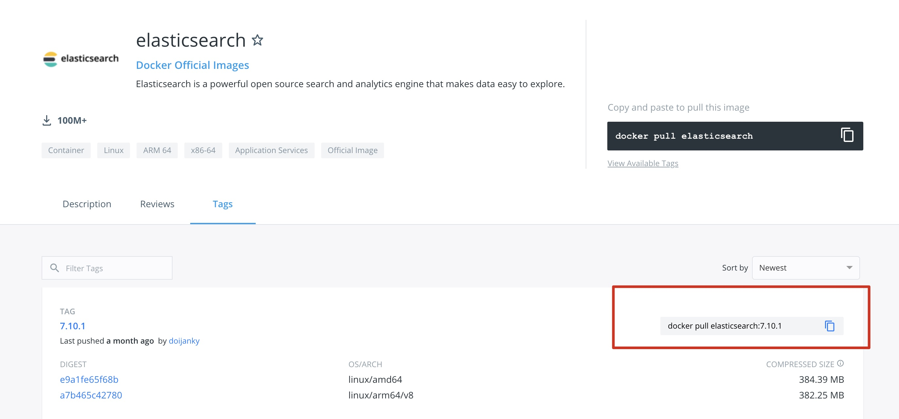
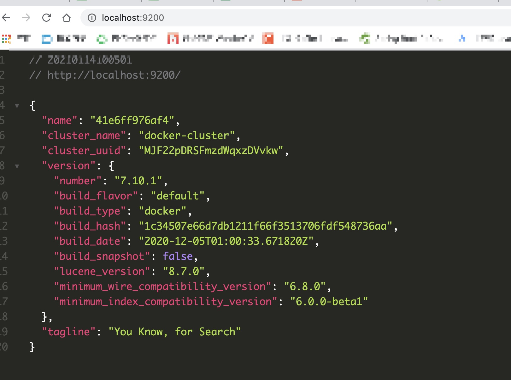
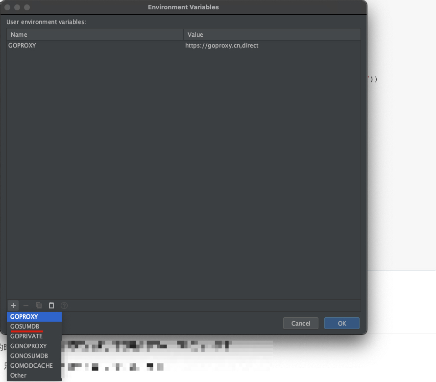
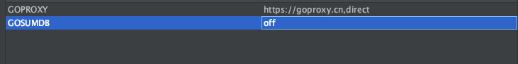

# 前言

ES 是目前非常流行的一个组件，用于搜索及日志管理方面。我也准备用 ES 对之前的搜索功能进行优化,结合之前的 Docker 技术，再熟悉下 Docker


# 下载安装运行

版本 7.10.1 

1. 去 docker 仓库中选择 自己需要的版本 [https://hub.docker.com/_/elasticsearch](https://hub.docker.com/_/elasticsearch)

2. 复制 命令拉取镜像 ` docker pull elasticsearch:7.10.1`

   

3. 运行镜像 `docker run --name shop-es -d -p 9200:9200 -p 9300:9300 -e "discovery.type=single-node" 558380375f1a`(请根据自己的情况调整 name 和 最后面镜像的 id。注意 discover.type 这个参数，这个表示是以单节点还是集群部署，我们就先用 单节点，如果不传入也不在配置文件中配，这个容器是启动不起来的)

4. 去本地的9200 端口验证

   

5. 

# GoDemo

需要引入  `"github.com/olivere/elastic/v7"`

```go
type Person struct {
 Name    string `json:"name"`
 Age     int    `json:"age"`
 Married bool   `json:"married"`
}

func main() {
 client, err := elastic.NewClient(elastic.SetSniff(false), elastic.SetURL("http://127.0.0.1:9200"))
 if err != nil {
    // Handle error
    panic(err)
 }

 fmt.Println("connect to es success")
 p1 := Person{Name: "lmh", Age: 18, Married: false}
 put1, err := client.Index().
    Index("user").
    BodyJson(p1).
    Do(context.Background())
 if err != nil {
    // Handle error
    panic(err)
 }
 fmt.Printf("Indexed user %s to index %s, type %s\n", put1.Id, put1.Index, put1.Type)
}
```

看下是否能连接成功


## 引入包时遇到的坑

在导入包的时候，我是怎么都通不过校验，下载是能下下来，不知道怎么回事(没有遇到就忽略这个)

这种时候，只能手动将安全校验给关掉，这个弄好之后再打开





这样就能绕过安全校验，成功引入包

# ES 集群

ES 搭建集群的话可以参考这个,比较简单 [https://juejin.cn/post/6844903810536587277](https://juejin.cn/post/6844903810536587277)

